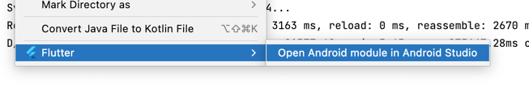
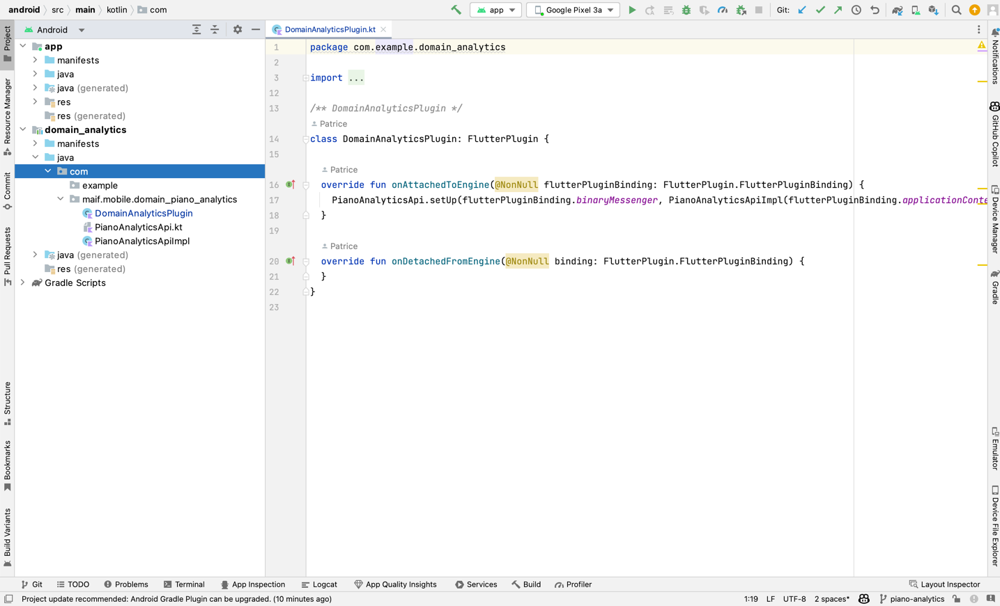
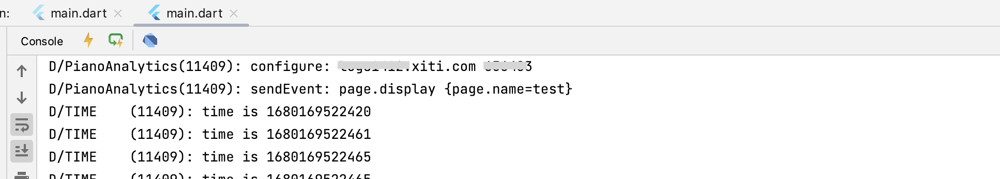
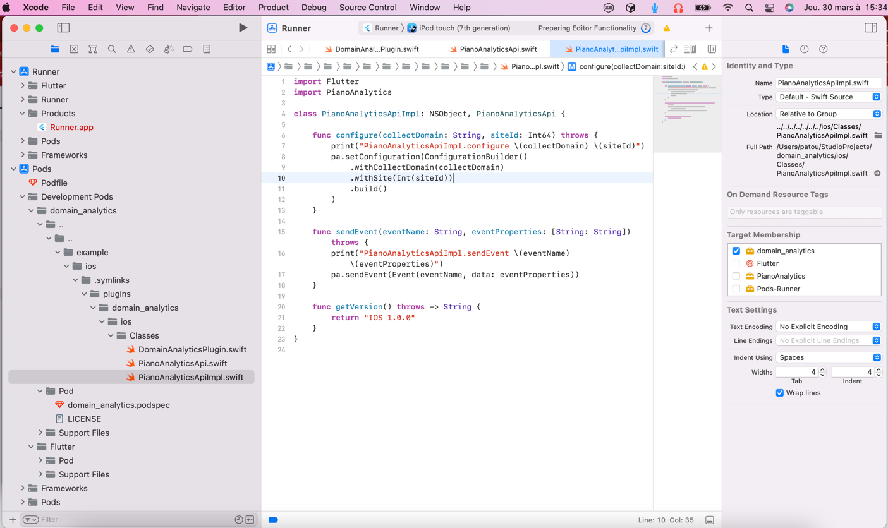
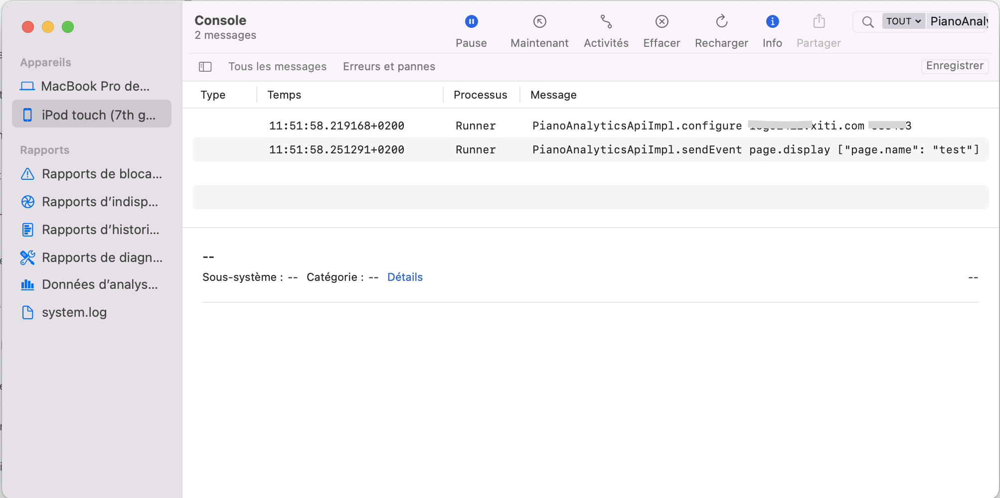
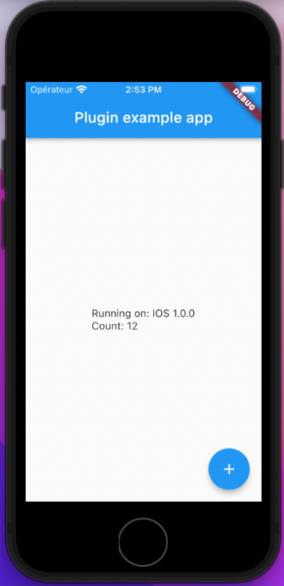
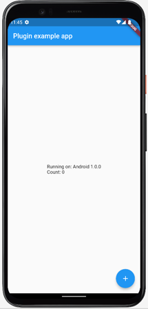

# plugin_analytics

Un plugin pour intérer le SDK Piano Analytics dans une application Flutter.

## Génération Pigeon

Commande pour générer le fichier dart à partir du fichier de définition pigeon/analytics.dart

```bash
flutter pub run pigeon --input pigeon/analytics.dart
```

## Tutorial

Piano Analytics est un SDK qui permet d'envoyer des événements à un serveur afin de les analyser.
Il est disponible pour Android et iOS mais pas Flutter.
Il est donc nécessaire de créer un plugin pour pouvoir l'utiliser dans une application Flutter.

### Créer un plugin

Pour créer un plugin, il faut créer un projet flutter avec le flag --template=plugin.

```bash
flutter create --template=plugin plugin_analytics
```

On a alors un projet qui contient plusieurs répertoires et fichiers.

```bash
plugin_analytics
├── android # Contient le code natif pour Android pour le plugin
│   ├── build.gradle
│   ├── src
├── ios # Contient le code natif pour iOS pour le plugin
│   ├── Classes
│   ├── plugin_analytics.podspec
├── example # Contient une application flutter d'exemple d'utilisation du plugin
│   ├── android
│   ├── ios
│   ├── lib
│   ├── test
├── lib # Contient le code dart du plugin
│   ├── plugin_analytics.dart
├── test # Contient les tests unitaires du plugin
│   ├── plugin_analytics_test.dart
├── pubspec.yaml
```

## Installer pigeon

```bash
flutter pub add dev:pigeon
```

## Créer l'interface Dart

Il faut commencer par écrire l'interface de notre plugin en dart.
Pour cela il faut écrire cette interface dans un répertoire en dehors de notre projet flutter.
En générale on crée un dossier pigeon dans le dossier racine du projet.

Créer un fichier dart dans le dossier pigeon/analytics.dart

```dart
import 'package:pigeon/pigeon.dart';

@ConfigurePigeon(PigeonOptions(
  dartOut: 'lib/piano/analytics.dart',
  kotlinOut:
  'android/src/main/kotlin/com/zenika/plugin_analytics/PianoAnalyticsApi.kt',
  kotlinOptions: KotlinOptions(package: 'com.zenika.plugin_analytics'),
  swiftOut: 'ios/Classes/PianoAnalyticsApi.swift',
))
@HostApi()
abstract class PianoAnalyticsApi {
  void configure(String collectDomain, int siteId);

  void sendEvent(String eventName, Map<String, String> eventProperties);

  String getVersion();
}
```

On décrire l'interface de notre plugin, les méthodes que l'on souhaite implémenter du côté natif.

Pigeon va s'occuper de générer tous le code nécessaire pour que l'on puisse appeler les méthodes de notre plugin depuis notre application Flutter.
Il va générer l'interface kotlin et swift pour les deux plateformes, qu'il faudra ensuite implémenter en kotlin et swift.

l'Annotation @ConfigurePigeon permet de configurer pigeon, on lui indique les fichiers de sortie pour les différentes plateformes.
Cela évite de devoir les renseigner à la ligne de commande.

## Créer les dossiers

Les dossier doivent être créés avant de lancer la commande pigeon, il ne crée pas automatiquement les fichiers.

```bash
mkdir lib/piano
mkdir -p android/src/main/kotlin/com/zenika/plugin_piano_analytics/
```

## Générer le fichier dart

```bash 
flutter pub run pigeon --input pigeon/analytics.dart
```

On a maintenant un fichier dart généré dans le dossier lib/piano/analytics.dart qui contient l'interface de notre plugin en dart que l'on pourra utiliser dans notre application Flutter.
On a également un fichier kotlin généré dans le dossier android/src/main/kotlin/com/zenika/mobile/plugin_piano_analytics/Analytics.kt qui contient l'interface de notre plugin en kotlin que l'on pourra implémenter dans notre application Android.
Et un fichier swift généré dans le dossier ios/Classes/Analytics.swift qui contient l'interface de notre plugin en swift que l'on pourra implémenter dans notre application iOS.

## Implémentation en kotlin

Pour modifier le projet dans Android Studio, il faut faire un clique droit sur le dossier android puis faire Flutter / Open Android Module in Android Studi :



Une nouvelle fenetre avec seulement le projet android sera ouverte permettant d'écrire le code dans le plugin et dans l'application exemple.



Dans le fichier Analytics.kt, on retrouve l'interface plus du code kotlin pour initialiser les méthodes channels et gérer les erreurs.

```kotlin
interface PianoAnalyticsApi {
  fun configure(collectDomain: String, siteId: Long)
  fun sendEvent(eventName: String, eventProperties: Map<String, String>)
  fun getVersion(): String
}
```

Créons maintenant la classe `PianoAnalyticsApiImpl` qui va implémenter l'interface `PianoAnalyticsApi`.

```kotlin
package com.zenika.mobile.plugin_piano_analytics

import android.util.Log
import java.util.*


class PianoAnalyticsApiImpl : PianoAnalyticsApi {
    private val tag = "PianoAnalytics"


    override fun configure(collectDomain: String, siteId: Long) {
        Log.d(
            tag,
            "configure: $collectDomain $siteId"
        )
    }

    override fun sendEvent(eventName: String, eventProperties: Map<String, String>) {
        Log.d(
            tag,
            "sendEvent: $eventName $eventProperties"
        )
    }

    override fun getVersion(): String {
        return "1.0.0"
    }
}
```

Il faut maintenant installer notre api dans le code de démarrage de notre plugin.

Pour cela on va dans la classe kotlin qui implémente `FlutterPlugin` et ajouter le code dans la méthode `onAttachedToEngine`.

```kotlin
class PluginAnalyticsPlugin: FlutterPlugin {

    override fun onAttachedToEngine(@NonNull flutterPluginBinding: FlutterPlugin.FlutterPluginBinding) {
        PianoAnalyticsApi.setUp(flutterPluginBinding.binaryMessenger, PianoAnalyticsApiImpl())
    }

    override fun onDetachedFromEngine(@NonNull binding: FlutterPlugin.FlutterPluginBinding) {
    }
}
```

Cette méthode setUp va installer notre api dans le code de démarrage de notre plugin et configurer le methode chanel



## Implémentation en swift

Pour modifier le projet Swift il est nécessaire d'ouvrir le projet dans Xcode en ouvrant le répertoire ios de l'application Example.



On peut retrouver dans Developpement Pod les fichiers du plugin.

Dans le fichier Analytics.swift, on retrouve l'interface plus du code swift pour initialiser les méthodes channels et gérer les erreurs.

```swift
protocol PianoAnalyticsApi {
  func configure(collectDomain: String, siteId: Int64) throws
  func sendEvent(eventName: String, eventProperties: [String: String]) throws
  func getVersion() throws -> String
}
```

Créons maintenant la classe PianoAnalyticsImpl qui va implémenter l'interface PianoAnalyticsAPI.

```swift
import Flutter

class PianoAnalyticsApiImpl: NSObject, PianoAnalyticsApi {

    func configure(collectDomain: String, siteId: Int64) throws {
        print("PianoAnalyticsApiImpl.configure \(collectDomain) \(siteId)")
    }

    func sendEvent(eventName: String, eventProperties: [String: String]) throws {
        print("PianoAnalyticsApiImpl.sendEvent \(eventName) \(eventProperties)")
    }

    func getVersion() throws -> String {
        return "IOS 1.0.0"
    }
}
```

Il faut maintenant installer notre api dans le code de démarrage de notre plugin.

```swift
public class PluginAnalyticsPlugin: NSObject, FlutterPlugin {
  public static func register(with registrar: FlutterPluginRegistrar) {
      let api = PianoAnalyticsApiImpl()
      PianoAnalyticsApiSetup.setUp(binaryMessenger: registrar.messenger(), api: api)
  }
}
```



## Utilisation dans l'application

Commençons par importer notre classe dart qui permet d'utiliser notre plugin.
```dart
import 'package:plugin_analytics/piano/analytics.dart';
```

Puis dans notre application, on peut appeler les méthodes de notre plugin.
```dart
void main() async {
  var pianoAnalytics = PianoAnalyticsApi();
  pianoAnalytics.configure("logsx.xiti.com", 12345);
  pianoAnalytics.sendEvent("page.display", {"page.name": "test"});

  var version = await pianoAnalytics.getVersion();
  print(version);
}
```

On utilise la classe dart généré comme une classe normal, mais derrière pigeon a généré des méthodes channels pour appeler les méthodes natives.

En lancant l'application, on peut voir dans les logs que les méthodes natives sont bien appelées.

Un exemple plus évolué avec une floating action qui envoie un event :

```dart
class _MyAppState extends State<MyApp> {
  String _platformVersion = 'Unknown';
  int counter = 0;
  final _pluginAnalyticsPlugin = PianoAnalyticsApi();

  @override
  void initState() {
    super.initState();
    initPlatformState();
  }

  // Platform messages are asynchronous, so we initialize in an async method.
  Future<void> initPlatformState() async {
    _pluginAnalyticsPlugin.configure("logsx.xiti.com", 12345);
    _pluginAnalyticsPlugin.sendEvent("page.display", {"page.name": "test"});

    var version = await _pluginAnalyticsPlugin.getVersion();
    print(version);

    // If the widget was removed from the tree while the asynchronous platform
    // message was in flight, we want to discard the reply rather than calling
    // setState to update our non-existent appearance.
    if (!mounted) return;

    setState(() {
      _platformVersion = version;
    });
  }

  @override
  Widget build(BuildContext context) {
    return MaterialApp(
      home: Scaffold(
          appBar: AppBar(
            title: const Text('Plugin example app'),
          ),
          body: Center(
            child: Text('Running on: $_platformVersion\n'),
          ),
          floatingActionButton: FloatingActionButton(
            onPressed: () {
              setState(() {
                counter++;
                _pluginAnalyticsPlugin
                    .sendEvent("count", {"value": "$counter"});
              });
            },
            child: Icon(Icons.add),
          )),
    );
  }
}
```


Résultat de l'application





## Implémenter l'appel à l'api PianoAnalytics native

Pour l'instant notre code ne faire que d'écrire dans la console les paramètres envoyés par l'application flutter.

Allons plus loins en utilisant maintenant vraiment notre api native. Pour cela on va suivre la [documentation de l'api PianoAnalytics](https://developers.atinternet-solutions.com/piano-analytics/data-collection/sdks/android-java)

## Coté Android

Ajoutons dans le fichier `build.gradle` du module android (du plugin et non de l'application example) la dépendance vers l'api PianoAnalytics.

```groovy
dependencies {
    implementation 'io.piano:analytics:3.2.0'
}
```

On peut maintenant implémenter les méthodes natives dans la classe PianoAnalyticsApiImpl.

```kotlin
package com.zenika.mobile.plugin_piano_analytics

import android.content.Context
import android.util.Log
import io.piano.analytics.Configuration
import io.piano.analytics.Event

import io.piano.analytics.PianoAnalytics
import java.util.*


class PianoAnalyticsApiImpl(context: Context) : PianoAnalyticsApi {
    private val tag = "PianoAnalytics"
    private val pa: PianoAnalytics

    init {
        pa = PianoAnalytics.getInstance(context)
    }


    override fun configure(collectDomain: String, siteId: Long) {
        Log.d(tag,"configure: $collectDomain $siteId")
        pa.setConfiguration(
            Configuration.Builder().withCollectDomain(collectDomain).withSite(siteId.toInt())
                .build()
        )
    }

    override fun sendEvent(eventName: String, eventProperties: Map<String, String>) {
        Log.d(tag,"sendEvent: $eventName $eventProperties")
        pa.sendEvent(Event(eventName, Collections.unmodifiableMap<String, Any>(eventProperties)))

    }

    override fun getVersion(): String {
        return "1.0.0"
    }
}
```

Dans l'initialisation du plugin, il faut maintenant faire passer le contexte de l'application.

```kotlin
PianoAnalyticsApi.setUp(flutterPluginBinding.binaryMessenger, PianoAnalyticsApiImpl(flutterPluginBinding.applicationContext))
```

Pour que la librairie fonctionne,il est nécessaire de bien configurer le manifest du plugin. 
pour donner la permission d'accéder au réseau et du surveiller l'état de la connexion

```xml
<manifest xmlns:android="http://schemas.android.com/apk/res/android" package="com.zenika.plugin_analytics">
    <uses-permission android:name="android.permission.INTERNET"/>
    <uses-permission android:name="android.permission.ACCESS_NETWORK_STATE" />
</manifest>
```

La librairie PianoAnalytics est maintenant bien intégrée dans notre plugin et si on possède un collectDomain et un siteId, on peut envoyer des events et les voir dans l'interface.

## Coté IOS

Pour IOS, on va suivre la [documentation de l'api PianoAnalytics](https://developers.atinternet-solutions.com/piano-analytics/data-collection/sdks/ios-swift)

Ajoutons tous d'abord la dépendence vers l'API PianoAnalytics dans le fichier `plugin_analytics.podspec`

```ruby
  s.dependency 'PianoAnalytics/iOS', '>=3.0'
```

On peut maintenant utiliser la librairie dans notre classe PianoAnalyticsApiImpl.

```swift
import Flutter
import PianoAnalytics

class PianoAnalyticsApiImpl: NSObject, PianoAnalyticsApi {
    private let tag = "PianoAnalytics"

    func configure(collectDomain: String, siteId: Int64) throws {
        print("PianoAnalyticsApiImpl.configure \(collectDomain) \(siteId)")
        pa.setConfiguration(ConfigurationBuilder()
            .withCollectDomain(collectDomain)
            .withSite(Int(siteId))
            .build()
        )
    }

    func sendEvent(eventName: String, eventProperties: [String: String]) throws {
        print("PianoAnalyticsApiImpl.sendEvent \(eventName) \(eventProperties)")
        pa.sendEvent(Event(eventName, data: eventProperties))
    }

    func getVersion() throws -> String {
        return "IOS 1.0.0"
    }
}
```

# Conclusion

Pigeon permet ainsi d'écrire facilement des plugins natives pour Flutter.
On écrit simplement l'interface Dart que l'on veut avoir et ensuite on a juste à implémenter les interfaces natives.